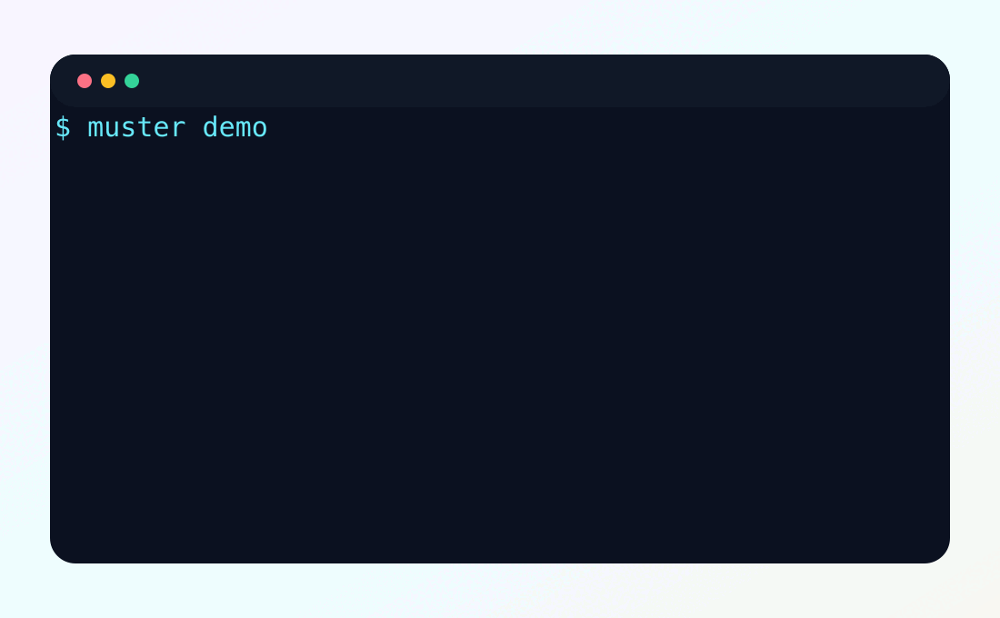
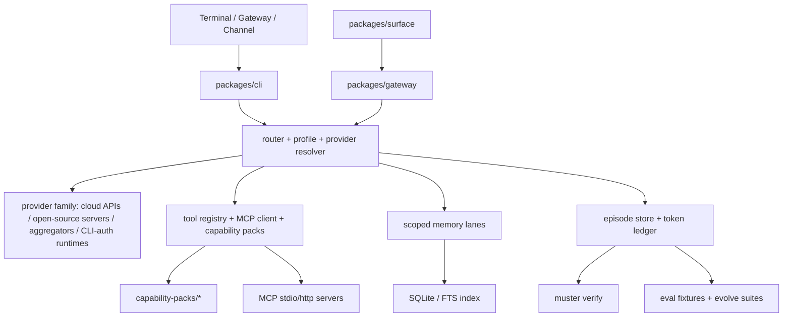

# Muster

**Muster is an open-source governed agent harness for production AI systems.**

Agents that run for more than a demo need boundaries: they should not leak memory, waste tokens, or learn new behavior without tests.

[](LICENSE)
[](package.json)
[](tsconfig.base.json)
[](https://www.npmjs.com/package/@musterhq/cli)

**Quick links:** [Website](https://themuster.dev) · [Docs](https://themuster.dev/docs.html) · [Architecture](docs/ARCHITECTURE.md) · [Roadmap](docs/SDLC_KANBAN.md) · [Contributing](CONTRIBUTING.md) · [Issues](https://github.com/Dkm0315/muster/issues)

```bash
pnpm --package=@musterhq/cli dlx muster demo
```

The demo is deterministic and does not need a model key. For the real interactive chat:

```bash
pnpm --package=@musterhq/cli dlx muster
```

That opens the terminal chat surface. First run opens onboarding; after setup it opens a named chat with slash commands, `@agent` routing, provider/model pickers, memory controls, plugin/MCP setup, and the token ledger.

## 20-Second Demo



A prompt enters the harness, scoped memory is recalled, the run completes, tokens are recorded, and integrity can be checked from the terminal.

Today you can run the same path locally:

```text
muster demo — provisioned an isolated workspace and a live stub model service.

> Where do we deploy?
  (recalled 1 scoped memory)
  Muster deploys to uat-erp.example.com (recalled from scoped memory).

run            model                        in       out      est  cost$    waste   session
----------------------------------------------------------------------------------------------
287bde9c-eb19- demo/demo-model              38       17       ~    -        -       -
653b434a-0924- demo/demo-model              7        18       ~    -        -       -

integrity check at 2026-06-12: OK
store      lines    corrupt
episodes   2        0
memory     3        0
tokens     2        0
```

## Proof: Token Waste Index

`muster benchmark` compares Muster against naive replay-everything context rendering. It is deterministic and makes no model calls.

| Scenario set | Turns | Naive tokens | Muster tokens | Reduction |
|---|---:|---:|---:|---:|
| Aggregate benchmark | 170 | 875.8k | 355.2k | 59.4% |

Full methodology: [benchmark/RESULTS.md](benchmark/RESULTS.md)

## Why Muster Exists

Most agents fail after the demo.

Long-running agents start clean, then accumulate hidden state:

- context grows until every turn replays too much history
- memory becomes unsafe when user, tenant, workspace, and session boundaries blur
- token usage disappears into provider logs instead of a local ledger
- "learning" becomes risky when feedback promotes behavior without evals
- automation becomes brittle when tools, MCP servers, browser actions, and app writes have no shared policy envelope

Muster exists to keep those controls outside the model provider.

## What Muster Does

| Problem | Muster control |
|---|---|
| Memory can leak across users or projects | **Scoped memory** with tenant, workspace, user, role, and session lanes, backed by SQLite/FTS retrieval and leakage tests. |
| Token cost becomes invisible | **Token ledger** records every run, estimates or records usage, and flags replay waste. |
| Tools run without boundaries | **Governed execution** routes tools, flows, subagents, browser work, and channels through explicit config, policy, and evidence. |
| Agents "learn" from vibes | **Eval-gated learning** turns feedback into replayable fixtures before behavior is promoted. |
| Integrations sprawl | **Capability packs** bundle typed tools, declared secrets, permissions, and setup guidance. |
| MCP servers are useful but risky | **MCP/plugin support** adds stdio/http servers with include/exclude policy, result caps, circuit breakers, and OAuth/PKCE helpers. |
| Browser and web apps need audit trails | **Browser and web-app automation** can be routed through the same harness and gateway surfaces. |
| ERP systems need domain context | **Frappe/ERPNext support** ships as a capability pack with permission-scoped tools and docs/live-context setup. |
| Provider choice should stay flexible | **Multi-provider LLM support** covers cloud APIs, open-source/self-hosted servers, aggregators, OpenAI-compatible endpoints, Gemini, Groq, Cerebras, Mistral, DeepSeek, Kimi, Qwen, OpenRouter, Together, Fireworks, LM Studio, vLLM, SGLang, Pi, Codex CLI, and Claude Code CLI. |

## Quick Start

### Prerequisites

- Node.js 24 or newer
- `pnpm` 10.x for repository development
- Optional: a configured provider key or local agent CLI for live model calls

### Try without a model key

```bash
pnpm --package=@musterhq/cli dlx muster demo
pnpm --package=@musterhq/cli dlx muster benchmark
```

`muster demo` uses a stub model service and an isolated workspace. `muster benchmark` is deterministic and makes no model calls.

### Install from source

```bash
git clone https://github.com/Dkm0315/muster.git
cd muster
pnpm install
pnpm build
pnpm hc demo
```

### Start a workspace

```bash
muster                 # interactive TUI; first run opens onboarding
muster onboard         # rerun guided setup
muster doctor --fix    # repair/check local config
muster status          # one-screen status
```

### Add a provider

Use presets when possible:

```bash
muster provider presets
muster provider add openai
muster runtime use-provider native openai
```

Common environment variables:

```bash
OPENAI_API_KEY=...
ANTHROPIC_API_KEY=...
GEMINI_API_KEY=...
GROQ_API_KEY=...
OPENROUTER_API_KEY=...
MISTRAL_API_KEY=...
DEEPSEEK_API_KEY=...
TOGETHER_API_KEY=...
```

For self-hosted or compatible endpoints:

```bash
muster provider add-openai-compatible private http://localhost:8000/v1 served-model
muster runtime use-provider native private
```

### Smallest working commands

```bash
muster run "Say hi in one sentence"
muster tokens
muster memory add --summary "uat deploy target is uat-erp.example.com" --scope user:me --provenance manual
muster memory search --scope user:me --query "deploy target"
muster verify
```

## Architecture

Muster is a TypeScript monorepo. The CLI is the main entry point; the core package owns governance, memory, providers, packs, flows, ledgers, and evals; the gateway and surface packages expose web/chat entry points.



Key directories:

- `packages/cli` — terminal chat, setup, commands, TUI, QA harnesses
- `packages/core` — run loop, memory, providers, MCP, capability packs, flows, ledgers, evals
- `packages/gateway` — HTTP gateway and channel/webhook adapters
- `packages/surface` — zero-dependency web client surface
- `capability-packs` — bundled packs such as Frappe/ERPNext, browser, web search, providers, channels
- `docs` — architecture, flow engine, setup/migration, retrieval, parity notes
- `website` — static Vite site for [themuster.dev](https://themuster.dev)

Muster uses provider APIs, OpenAI-compatible servers, aggregators, self-hosted open-source inference, and native agent CLIs where useful, but keeps governance outside the provider: scoped memory, token accounting, evidence, eval gates, MCP policy, and integrity verification remain Muster-owned.

## Real-World Use Cases

- **Frappe / ERPNext operator workflows**: build scoped context from Frappe/ERPNext docs, installed apps, DocTypes, fields, workflows, and records before acting through permission-scoped tools.
- **Browser automation**: route browser-capable work through explicit setup, screenshots/evidence, and approval-aware tool boundaries.
- **Enterprise web-app automation**: use the gateway and web surface to connect app events to governed runs.
- **Governed long-running agents**: keep sessions, memory, token spend, and learning visible over days or weeks.
- **MCP-based capability extension**: attach MCP servers with per-server policy, result caps, OAuth setup, and failure isolation.

## Comparison

Muster is not trying to replace every agent framework. It is the governance layer for agents that need to run with memory, tools, and accountability.

| Category | What they optimize for | Where Muster fits |
|---|---|---|
| Generic agent frameworks such as AutoGen or CrewAI | agent roles, collaboration patterns, task decomposition | Muster focuses on run governance: memory scope, token ledger, eval gates, capability policy, and integrity checks. |
| Workflow graph tools such as LangGraph | explicit graph/state machines for agent workflows | Muster includes flows, but its wedge is the harness around runs: scoped memory, provider routing, MCP policy, token accounting, and eval-backed learning. |
| Coding agents such as Codex or Claude Code | high-quality coding interaction with native tools | Muster can route through these CLIs when you want subscription-auth coding workflows, while keeping local ledgers, sessions, provider policy, and capability boundaries. They are optional routes, not the whole harness. |
| OpenClaw/Hermes-inspired systems | broad agent surfaces, adapters, skills, and operational UX | Muster is inspired by their breadth and UX patterns, but is narrower and more explicit about governance. Not every inspired catalog entry is a fully wired runtime adapter. |

OpenClaw and Hermes have broader mature ecosystems. Muster's current edge is auditability: scoped memory, token visibility, eval-gated learning, MCP policy, and an integration induction layer that marks setup plans differently from executable packs.

## Implementation Status

Muster is pre-1.0. Core governance paths are implemented and tested; public APIs and integration surfaces may still change.

| Area | Current state |
|---|---|
| CLI/TUI | Implemented. `muster` opens the chat UI after onboarding with slash-command completion, `@agent` completion, history, named sessions, provider/model/runtime pickers, token, plugin, skill, MCP, and memory commands. |
| Provider/runtime path | Implemented for direct APIs, OpenAI-compatible providers, aggregators, local/self-hosted servers, Pi, Codex CLI, and Claude Code CLI. Presets include OpenAI, Anthropic, Gemini, xAI, Kimi, DeepSeek, Mistral, Qwen, Zhipu, Perplexity, Groq, Cerebras, OpenRouter, Together, Fireworks, LM Studio, vLLM, and SGLang. |
| Memory | Implemented. Scoped memory uses SQLite/FTS with receipt reporting, graph-linked expansion, latency probes, rebuild/doctor commands, and leakage tests. |
| Token/cost | Implemented. Per-run ledger, cost estimates where pricing is known, replay-waste detection, session mode/id tracking, and skill attribution. |
| Plugins/skills | Implemented base system. In-repo capability packs are executable; broader catalog entries are marked by actionability. |
| MCP | Implemented client, stdio/http registration, include/exclude policy, result caps, circuit breakers, OAuth/PKCE setup/import, and curated install catalog. |
| Frappe/ERPNext | Implemented as a capability pack with docs/live-context setup, module/doc resources, Frappe tools, generic graph-retrieval eval fixtures, and web-framework checks. |
| Gateway/channels | Framework and setup packs exist for Telegram, Slack, Discord, WhatsApp, Google Chat, Teams, and web. Production hardening depends on real provider credentials and webhook setup. |
| Dashboard/web UI | Basic status/export/start surfaces exist. Full desktop app is not done. |

## Roadmap

The detailed working board lives in [docs/SDLC_KANBAN.md](docs/SDLC_KANBAN.md). The public roadmap is:

### Now

- harden TUI and setup workflows with PTY tests
- expand real-provider latency tests
- tighten Telegram/channel setup and live diagnostics
- improve README, website, examples, and demos

### Next

- deeper MCP auth failure tests and setup workflows
- Frappe/ERPNext hybrid graph retrieval for installed apps, modules, DocTypes, and docs
- more browser automation examples with evidence capture
- stronger provider/model picker workflows and latency hints
- more capability-pack eval suites

### Later

- richer dashboard/desktop surfaces
- community capability-pack registry
- more channel adapters and live round-trip QA
- hosted demo assets, videos, and example repos

## Contributing

Contributions are welcome. Start small and keep changes testable.

```bash
pnpm install
pnpm typecheck
pnpm test
pnpm hc demo
```

Good contribution areas:

- documentation and examples
- demo GIF/video and screenshots
- Frappe/ERPNext packs, eval fixtures, and retrieval tests
- provider adapters and latency benchmarks
- MCP setup workflows and auth failure tests
- browser automation examples
- TUI interaction tests
- capability-pack manifests and safety checks

Look for [`good first issue`](https://github.com/Dkm0315/muster/issues?q=is%3Aissue+is%3Aopen+label%3A%22good+first+issue%22) and [`help wanted`](https://github.com/Dkm0315/muster/issues?q=is%3Aissue+is%3Aopen+label%3A%22help+wanted%22). For larger work, open an issue first so the design can be reviewed before code.

## FAQ

### Is Muster another agent framework?

Not exactly. Muster is a governed harness around agents. It can route to agent CLIs, OpenAI-compatible providers, MCP servers, capability packs, and gateway surfaces while keeping memory, tokens, learning, and tool policy auditable.

### How is it different from LangGraph, CrewAI, or AutoGen?

Those projects focus on building agent workflows and collaboration patterns. Muster focuses on what happens around long-running agents: scoped memory, token visibility, eval-gated learning, capability boundaries, and integrity checks.

### Why governed agents?

Because production agents accumulate state. Without governance, memory leaks, token waste, silent fallback, and untested learning become operational risks.

### Does it work with Frappe/ERPNext?

Yes. The Frappe/ERPNext capability pack exists in `capability-packs/frappe` and supports permission-scoped tools plus docs/live-context setup. Deeper hybrid graph retrieval is on the roadmap.

### Does it support MCP?

Yes. Muster supports stdio and HTTP MCP servers, include/exclude policy, result caps, circuit breakers, OAuth/PKCE setup, and a curated install catalog.

### Can I use different LLM providers?

Yes. Muster is provider-family agnostic. It supports direct cloud APIs, Gemini-compatible routes, OpenAI-compatible HTTP providers, aggregators, open-source/self-hosted inference servers, Pi, Codex CLI, and Claude Code CLI. Use `muster provider presets` to see built-ins and `muster provider add-openai-compatible` for any custom endpoint.

## License

MIT. Open source, community-driven.
